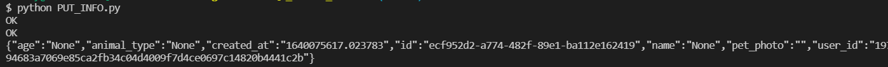
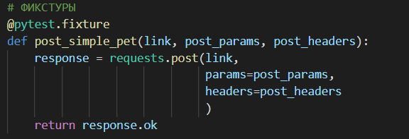

# API и его тестирование

## Чтобы начать работу, необходимо получить ключ аутенфикации пользователя с помощью GET запроса:

## Добавим новое животное без фотографии:

## Просмотрим список, добавленных мною животных: 

## Добавим фотографию к добавленному животному:

## Получим информацию по всем животным:

## Добавим новое животное с фотографией:

# Тестирование API

Запустим тест

В ходе выполнения тестов мы получаем ожидаемую ошибку.

В коде тестов использовалась как параметризация, так и фикстура:

Фикстура:

Параметризация

