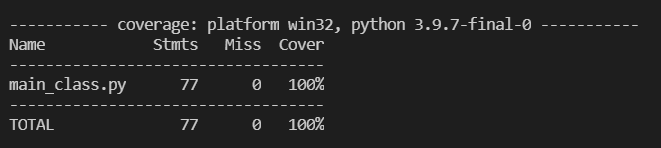
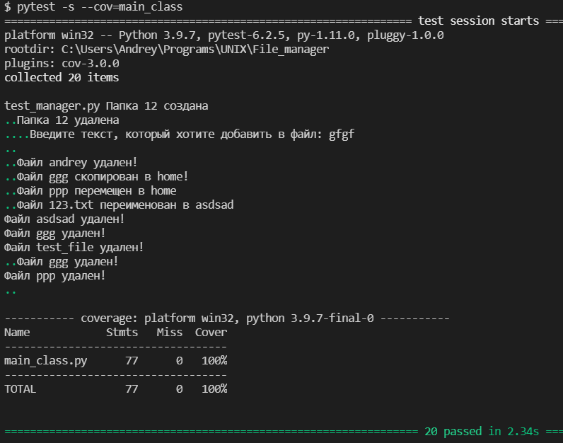
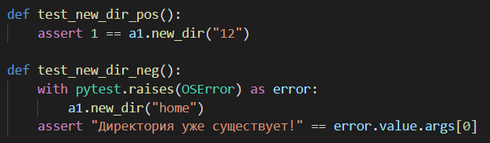

# Тестирование файлового менеджера

## Сборка проекта

Чтобы запустить тесты, введите команду:

```
	pytest -s --cov=main_class
```

## Покрытие тестами



## Результат тестирования



## Описание тестов

Использовал два вида тестов: позитивные и негативные. 


Опишу две представленные выше функции, так как остальные сделаны аналогичным образом.

### test_new_dir_pos

Так как каждая функция файлового менеджера либо вернет 1, как знак удачного выполнения функции, либо выдаст исключение, поэтому в позитивных тестах я всегда сравниваю то, что вернет функция, с 1. Все остальные тесты сделаны аналогичным образом.

### test_new_dir_neg

Как я сказал выше, функция возвращает либо 1, либо исключение, поэтому вызвать негативный тест можно с помощью некорректно поданных данных. Функция вызывает метод в классе файлового менеджера и ждет исключения. Когда оно получено, то оно сравнивается с предполагаемым текстом и, если оно совпадает, то тест считается пройденным.
