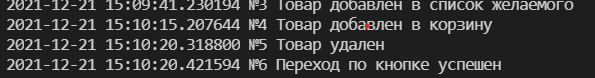

# Тестирование сайта

В файле autotest.py описаны базовые тесты для сайта, на котором есть: поиск, фильтрация, сортировка, добавление в избранное и так далее.

# Алгоритм работы

1) Тест открывает браузер
2) По HTML коду ищет указанный путь, который указан во втором параметре функции find_element().
3) Когда элемент найден, на него происходит либо нажатие (для кнопок), либо ввод данных (для полей поиска)
4) Если тест успешен, то выводится сообщение об успешном тестировании.

Каждый тест описан в функции.
